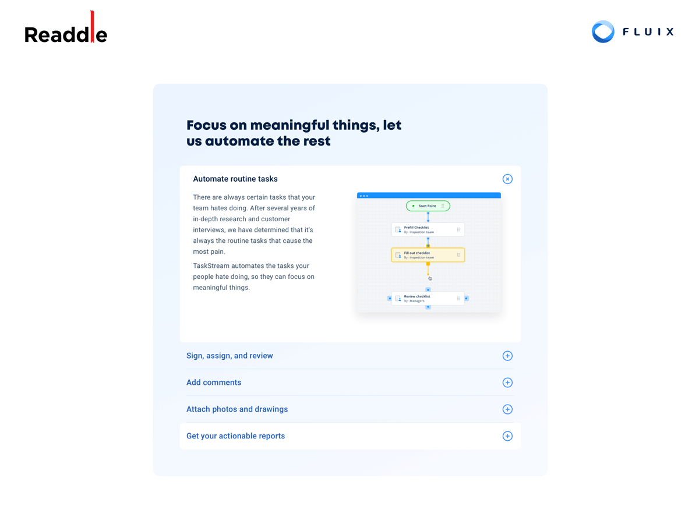

# Test task for the Web Developer role at Fluix
[](http://2523931.dglance.web.hosting-test.net/)

*This is a [Test task](https://docs.google.com/document/d/1LZDVfFUh8_Kb-4LcsiHk4ez1tjVZkClt_B7P8EcI210/edit) for the position of [Web Developer - Fluix Team](https://djinni.co/jobs/495298-web-developer-fluix-team/) ([Readdle](https://readdle.com/))* <br/>
It lives at ---> [<b>DEMO</b>](http://2523931.dglance.web.hosting-test.net/)

---

## About
There is the “Accordion” section. It is used to provide some information to a visitor, something like a FAQ.
## Task
Gutenberg block for the section from [Sketch mockup](https://www.sketch.com/s/ed3563a0-853f-4f73-8e14-5f7a0adccca3/a/Myb9A7W). The collapsing/expanding should be animated by height. It should be allowed for content-editors to either collapse other blocks after clicking on some block, or to collapse a particular clicked one. The list of collapsible blocks must contain only them (other stuff is forbidden). It should be able to add as many collapsible blocks to the collapsible grid as content-editors wish, as well as as many collapsible lists per page as they wish too. Your Gutenberg block should be written using native WordPress scripts, no libraries allowed. Your script should be written by pure JS, no libraries allowed. Please, apply [our custom lazy-loading](https://drive.google.com/drive/folders/1ZzYOkMIN7CpigYWyLcyfLjNOPUuvjJYb) for images.
## Implementation
<ul>
<li>To complete the task, a clean WordPress theme was created.</li>
<li>There are two custom image sizes created in the theme functions for different types of displays.</li>
<li>Created a separate category "Fluix" for my gutenberg blocks.</li>
<li>To implement the backend part, the ACF Pro plugin with the ACF Extended extension is used.</li>
<li>Created appropriate ACF fields for the Gutender block (text title, item repeater with image and text content, block mode switcher).</li>
<li>In the layout of the markup, I used semantic HTML tags: main, section, details, picture.</li>
<li>Attributes for alternative srcset resources are used to display images.</li>
<li>The provided library for LazyLoad is used.</li>
<li>Custom javascript is written in VanillaJS without the use of third-party libraries, according to the terms of the task.</li>
<li>Connected font "Roboto" from google fonts (weight 400 and 500) asynchronously.</li>
<li>Font "Mont-heavy" for headings borrowed from the Fluix site and included locally.</li>
<li>Webpack builder is used to build SCSS and javascript.</li>
<li>The style normalizer normalize.css is used.</li>
<li>The Bootstrap library is connected (only separate SCSS components for the grid, responsive mixins, helpers).</li>
<li>Defined base fonts and colors in SCSS variables.</li>
<li>Styles for basic typography are described.</li>
<li>The block responsiveness for basic screen size breakpoints has been worked out. The layout approach is mobile first.</li>
<li>On the main page of my demo, two instances of my Gutenberg block are displayed in two modes. In the first, when one item is revealed, the rest collapse. In the second, the user is allowed to expand all items.</li>
<li>The whole task with deployment and documentation took about 6 hours.</li>
</ul>

---

## Get started

To run Webpack  -install the dependencies...<br/>
<b>node</b> - v14.17.3<br/>
<b>npm</b> - 6.14.13


```bash
npm install
```

## To start

...as `dev` mode:

```bash
npm run dev
```

...as `build` mode:

```bash
npm run build
```
